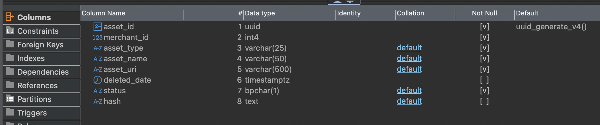

# merchant.asset

| Field          | Comment (translated)                                                                                                               |
| -------------- | ---------------------------------------------------------------------------------------------------------------------------------- |
| `asset_id`     | uuid generate v4                                                                                                                   |
| `merchant_id`  | RN.merchant.merchantId                                                                                                             |
| `asset_type`   | MerchantLogo?                                                                                                                      |
| `asset_name`   | MerchantLogo[id]?                                                                                                                  |
| `asset_uri`    | url = RN.merchant.data.imageBaseUrl + RN.merchant.data.logoImage or should we add the logo images like those at entertainment.com? |
| `deleted_date` | null                                                                                                                               |
| `status`       | What should the status be? I see value "A" in the database.                                                                        |
| `hash`         | null                                                                                                                               |
