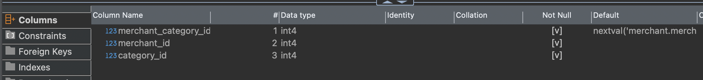

# merchant.categories

| Field                  | Comment (translated)                                                |
| ---------------------- | ------------------------------------------------------------------- |
| `merchant_category_id` | nextval                                                             |
| `merchant_id`          | RN.merchant.merchantId                                              |
| `category_id`          | I’m not sure how we determine the category — do you have any ideas? |
