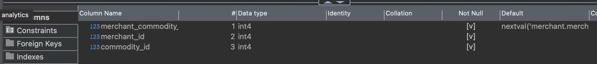

# merchant.commodity

| Field                   | Comment (translated)                                                                                                     |
| ----------------------- | ------------------------------------------------------------------------------------------------------------------------ |
| `merchant_commodity_id` | nextval                                                                                                                  |
| `merchant_id`           | RN.merchant.merchantId                                                                                                   |
| `commodity_id`          | Looks like we can use RN.merchant.data.cuisines to get IDs from config.commodities. What if no commodity is found by ID? |
