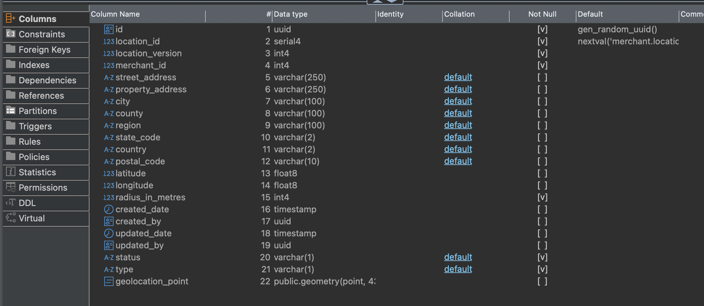

# merchant.locations

| Field               | Comment (translated)                                                                            |
| ------------------- | ----------------------------------------------------------------------------------------------- |
| `id`                | uuid generate v4                                                                                |
| `location_id`       | nextval                                                                                         |
| `location_version`  | What version should we assign?                                                                  |
| `merchant_id`       | RN.merchant.merchantID                                                                          |
| `street_address`    | RN.merchant.data.location.address.address1                                                      |
| `property_address`  | For property_address, should we use RN.merchant.data.location.address.address2?                 |
| `city`              | RN.merchant.data.location.address.city                                                          |
| `county`            | null                                                                                            |
| `region`            | null                                                                                            |
| `state_code`        | RN.merchant.data.location.address.state                                                         |
| `country`           | Should we hardcode "US" here?                                                                   |
| `postal_code`       | RN.merchant.data.location.address.zip                                                           |
| `latitude`          | RN.merchant.data.location.address.latitude                                                      |
| `longitude`         | RN.merchant.data.location.address.longitude                                                     |
| `radius_in_metres`  | 0                                                                                               |
| `created_date`      | current date                                                                                    |
| `created_by`        | 000                                                                                             |
| `updated_date`      | current date                                                                                    |
| `updated_by`        | 000                                                                                             |
| `status`            | What status?                                                                                    |
| `type`              | What type?                                                                                      |
| `geolocation_point` | POINT (RN.merchant.data.location.address.longitude, RN.merchant.data.location.address.latitude) |
