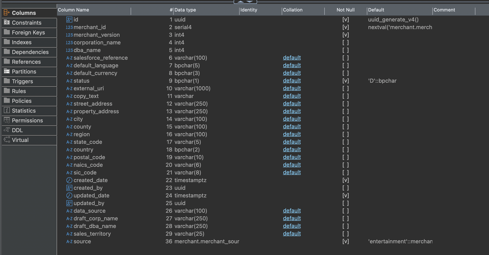

# merchant.merchants

| Field                  | Comment (translated)                                                                                                           |
| ---------------------- | ------------------------------------------------------------------------------------------------------------------------------ |
| `id`                   | uuid generate v4                                                                                                               |
| `merchant_id`          | We have RN.merchant.merchantId — should we use this as merchant_id or generate the next value for mom.merchant_id differently? |
| `merchant_version`     | What value should merchant_version have?                                                                                       |
| `corporation_name`     | null                                                                                                                           |
| `dba_name`             | null                                                                                                                           |
| `salesforce_reference` | null                                                                                                                           |
| `default_language`     | en-US                                                                                                                          |
| `default_currency`     | USD                                                                                                                            |
| `status`               | What status should be set?                                                                                                     |
| `external_uri`         | Should this be RN.merchant.data.websiteUrl?                                                                                    |
| `copy_text`            | Should we use RN.merchant.data.description for this field?                                                                     |
| `street_address`       | RN.merchant.data.location.address.address1                                                                                     |
| `property_address`     | For property_address, should we use RN.merchant.data.location.address.address2?                                                |
| `city`                 | RN.merchant.data.location.address.city                                                                                         |
| `county`               | null                                                                                                                           |
| `region`               | null                                                                                                                           |
| `state_code`           | RN.merchant.data.location.address.state                                                                                        |
| `country`              | Hardcode to US?                                                                                                                |
| `postal_code`          | RN.merchant.data.location.address.zip                                                                                          |
| `naics_code`           | null                                                                                                                           |
| `sic_code`             | null                                                                                                                           |
| `created_date`         | current date                                                                                                                   |
| `created_by`           | 000                                                                                                                            |
| `updated_date`         | current date                                                                                                                   |
| `updated_by`           | 000                                                                                                                            |
| `data_source`          | What should we add here?                                                                                                       |
| `draft_corp_name`      | Should we add RN.merchant.merchantName here?                                                                                   |
| `draft_dba_name`       | Should we add RN.merchant.merchantName here?                                                                                   |
| `sales_territory`      | null                                                                                                                           |
| `source`               | rewards_network                                                                                                                |
